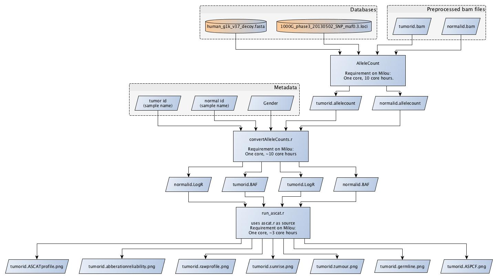

# ASCAT

## Introduction

ASCAT is a software for performing allele-specific copy number analysis of tumor samples and for estimating tumor ploidy and purity (normal contamination).
ASCAT is written in R and available here: [github.com/Crick-CancerGenomics/ascat](https://github.com/Crick-CancerGenomics/ascat).

To run ASCAT on NGS data we need .bam files for the tumor and normal samples, as well as a loci file with SNP positions.
If ASCAT is run on SNP array data, the loci file contains the SNPs on the chip.
When runnig ASCAT on NGS data we can use the same loci file, for exampe the one corresponding to the AffymetrixGenome-Wide Human SNP Array 6.0, but we can also choose a loci file of our choice with i.e. SNPs detected in the 1000 Genomes project.

### BAF and LogR values

Running ASCAT on NGS data requires that the .bam files are converted into BAF and LogR values.
This can be done using the software [AlleleCount](https://github.com/cancerit/alleleCount) followed by a simple R script.
AlleleCount extracts the number of reads in a bam file supporting each allele at specified SNP positions.
Based on this, BAF and logR can be calculated for every SNP position i as:

```
BAFi(tumor)=countsBi(tumor)/(countsAi(tumor)+countsBi(tumor))
BAFi(normal)=countsBi(normal)/(countsAi(normal)+countsBi(normal))
LogRi(tumor)=log2((countsAi(tumor)+countsBi(tumor))/(countsAi(normal)+countsBi(normal)) - median(log2((countsA(tumor)+countsB(tumor))/(countsA(normal)+countsB(normal)))
LogRi(normal)=0
```

For male samples, the X chromosome markers have special treatment:

```
LogRi(tumor)=log2((countsAi(tumor)+countsBi(tumor))/(countsAi(normal)+countsBi(normal))-1 - median(log2((countsA(tumor)+countsB(tumor))/(countsA(normal)+countsB(normal))-1)
```

where:  
*i* corresponds to the postions of all SNPs in the loci file.  
*CountsA* and *CountsB* are vectors containing number of reads supporting the *A* and *B* alleles of all SNPs  
*A* = the major allele  
*B* = the minor allele  
*Minor* and *major* alleles are defined in the loci file (it actually doesn't matter which one is defied as A and B in this application)  

Calculation of LogR and BAF based on AlleleCount output is done as in [runASCAT.R](https://github.com/cancerit/ascatNgs/tree/dev/perl/share/ascat/runASCAT.R) in the ascatNgs repository on Github.

### Loci file

The loci file was created based on the 1000Genomes latest release (phase 3, releasedate 20130502), available [here](ftp://ftp.1000genomes.ebi.ac.uk/vol1/ftp//release/20130502/ALL.wgs.phase3_shapeit2_mvncall_integrated_v5b.20130502.sites.vcf.gz). The following filter was applied: Only bi-allelc SNPs with minor allele frequencies > 0.3. The filtered file can be found on [export.uppmax.uu.se](https://export.uppmax.uu.se/b2015110/caw-references/b37/1000G_phase3_20130502_SNP_maf0.3.loci.tar.bz2) and is stored on Uppmax in:


```
/sw/data/uppnex/ToolBox/ReferenceAssemblies/hg38make/bundle/2.8/b37/1000G_phase3_20130502_SNP_maf0.3.loci
```

The loci file was originally generated for GRCh37.
It was translated into GRCh38 using the tool liftOver available at the UCSC Genome Browser.
To run liftOver the loci file was first written in bed format:

```
awk '{print "chr"$1":"$2"-"$2}' 1000G_phase3_20130502_SNP_maf0.3.loci > 1000G_phase3_20130502_SNP_maf0.3.bed
```

Using the web interface to liftOver at [genome.ucsc.edu](https://genome.ucsc.edu/cgi-bin/hgLiftOver) the file was translated into GRCh38 coordinates.
LiftOver was possible for 3261270 out of 3268043 SNPs.
The converted SNP positions were printed in the format required by AlleleCounter by:

```
more hglft_genome_5834_13aba0.bed | awk 'BEGIN{FS="chr"} {print $2}' | awk 'BEGIN{FS="-"} {print $1}' | awk 'BEGIN{FS=":";OFS="\t"} {print $1,$2}' > 1000G_phase3_GRCh38_maf0.3.loci
```

The loci file in GRCh38 coordinates is stored on Uppmax in:

```
/sw/data/uppnex/ToolBox/ReferenceAssemblies/hg38make/bundle/2.8/1000G_phase3_GRCh38_maf0.3.loci
```
## GC correction file
Input files for Ascat's GC correction were created for the above loci files, using the scripts and instructions on Ascat's github repository: https://github.com/Crick-CancerGenomics/ascat/tree/master/gcProcessing.  

The final files are tab-delimited with the following columns (and some example data):  
Chr Position	25bp	50bp	100bp	200bp	500bp	1000bp	2000bp	5000bp	10000bp	20000bp	50000bp	100000bp	200000bp	500000bp	1M	2M	5M	10M  
snp1	1	14930	0.541667	0.58	0.61	0.585	0.614	0.62	0.6	0.5888	0.588	0.4277	0.395041	0.380702	0.383259	0.341592	0.339747	0.386343	0.500537	0.511514  
snp2	1	15211	0.625	0.64	0.67	0.63	0.61	0.612	0.6135	0.591	0.5922	0.4358	0.39616	0.380411	0.383167	0.34163	0.339771 0.386417	0.500558	0.511511   
snp3	1	15820	0.541667	0.56	0.62	0.655	0.65	0.612	0.5885	0.5936	0.5797	0.4511	0.397771	0.379945	0.382999	0.341791	0.339832	0.386554	0.500579	0.511504  

The GC correction file in GRCh37 coordinates are stored on Uppmax in: 
```
/sw/data/uppnex/ToolBox/ReferenceAssemblies/hg38make/bundle/2.8/b37/1000G_phase3_20130502_SNP_maf0.3.loci.gc
```

The GC correction file in GRCh38 coordinates are stored on Uppmax in: 
```
/sw/data/uppnex/ToolBox/ReferenceAssemblies/hg38make/bundle/2.8/1000G_phase3_GRCh38_maf0.3.loci.gc
```

## Running on Uppmax

### Run AlleleCount

AlleleCount is installed as part of the `bioinfo-tools` module on Uppmax. It runs on single bam files (tumor and normal separately) with the command below:

```bash
$ module load bioinfo-tools alleleCount
$ alleleCounter -l /sw/data/uppnex/ToolBox/ReferenceAssemblies/hg38make/bundle/2.8/b37/1000G_phase3_20130502_SNP_maf0.3.loci -r /sw/data/uppnex/ToolBox/ReferenceAssemblies/hg38make/bundle/2.8/b37/human_g1k_v37_decoy.fasta -b sample.bam -o sample.allecount
```

### Convert allele counts to LogR and BAF values

The allele counts can then be converted into LogR and BAF values using the script `convertAlleleCounts.r`.
Usage for a male sample (`Gender = "XY"`, replace with `Gender = "XX"` for a female sample):

```bash
sbatch -A PROJID -p core -n 1 -t 240:00:00 -J convertAllelecounts -e convertAllelecounts.err -o convertAllelecounts.out /path/to/your/Sarek-fork/convertAlleleCounts.r tumor_sample tumor.allelecount normal_sample normal.allelecount XY
```

This creates the BAF and LogR data for the tumor and normal samples, to be used as input to ASCAT.

### Run ASCAT

The script "bin/run_ascat.r" can be used to run ASCAT **with** correction for the local CG content across the genome, and with parameter gamma=1 which is the recommended setting for NGS data. It calls the main ASCAT R script [ascat.R](https://github.com/Crick-CancerGenomics/ascat/tree/master/ASCAT/R/ascat.R)

```bash
sbatch -A PROJID -p core -n 1 -t 240:00:00 -J ascat -e ascat.err -o ascat.out run_ascat.r tumor_baf tumor_logr normal_baf normal_logr baseDir gcfile
```
Where:  
*baseDir* is the path to the local copy of ascat.R  
*gcfile* is the GC correction file   
  
### Output
The Ascat process gives several images as output, described in detail in this [book chapter](http://www.ncbi.nlm.nih.gov/pubmed/22130873).  
The script also gives out a text file (*tumor.cnvs.txt*) with information about copy number state for all the segments predicted by Ascat. The output is a tab delimited text file with the following columns:  chr     startpos        endpos  nMajor  nMinor 
Where:  
*chr* is the chromosome number  
*startpos* is the start position of the segment  
*endpos* is the end position of the segment  
*nMajor* is number of copies of one of the allels (for example the chromosome inherited from the father)  
*nMinor* is the number of copies of the other allele (for example the chromosome inherited of the mother)   
The file *tumor.cnvs.txt* contains all segments predicted by Ascat, both those with normal copy number (nMinor = 1 and nMajor =1) and those corresponding to copy number aberrations. 

## Flowchart
Flowchart is slighly outdated as id doesn't inlcude the GC correction files.  

